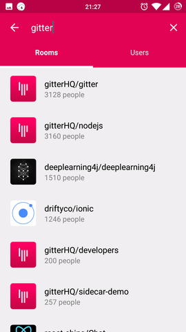

# GitterMobile

> [Gitter](https://gitter.im) client for mobile devices (currently only for android).

## App preview

## Features
See [Roadmap](https://github.com/terrysahaidak/project/issues/5).

## Installation
Once you have downloaded or cloned this repository, run `npm install` inside the directory.

## Usage
- [Setting up React Native for Android](https://facebook.github.io/react-native/docs/android-setup.html#content)
- [Running app on Android Device](https://facebook.github.io/react-native/docs/running-on-device-android.html#content)

## Need help
- Mark visible messages as read once you have navigated to room. See [#17](https://github.com/terrysahaidak/project/issues/17)
- Use Faye client as an android service. See [#6](https://github.com/terrysahaidak/project/issues/6)

## License
All the code available under the MIT + Apache 2.0. See [LICENSE](LICENSE).
