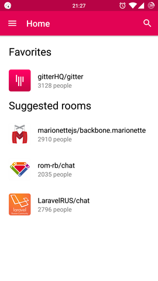
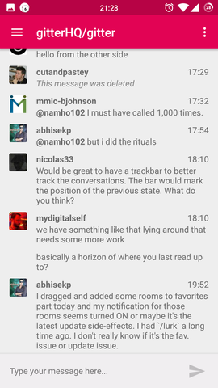
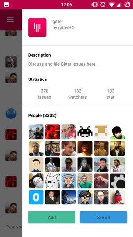
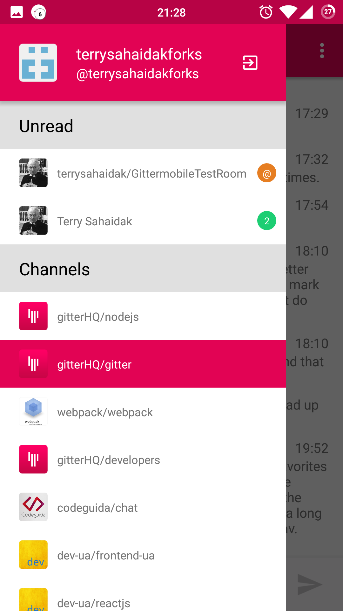

# GitterMobile

[](https://gitter.im/terrysahaidak/GitterMobile?utm_source=badge&utm_medium=badge&utm_campaign=pr-badge&utm_content=badge)

> Unofficial [Gitter.im](https://gitter.im) client for iOS and Android.

## Download
Go to the [releases page](https://github.com/terrysahaidak/GitterMobile/releases) to download the latest available apk.

## App preview








## Features
See [Roadmap](https://github.com/terrysahaidak/project/issues/5).

## Technical stack
- [React Native](https://facebook.github.io/react-native/)
- [Redux](http://redux.js.org/)
- [react-native-navigation](https://github.com/wix/react-native-navigation)
- [react-native-vector-icons](https://github.com/oblador/react-native-vector-icons)
- [react-invertible-scroll-view](https://github.com/expo/react-native-invertible-scroll-view)
- [react-native-fetch-blob](https://github.com/wkh237/react-native-fetch-blob)
- [react-native-scrollable-tab-view](https://github.com/skv-headless/react-native-scrollable-tab-view)
- [react-native-transformable-image](https://github.com/terrysahaidak/react-native-transformable-image)

## Installation
Once you have downloaded or cloned this repository, run `npm install` inside the directory, then you need to create `local.js` file inside `app` directory with following content:

```
export const CLIENT_ID = 'oauth key'
export const CLIENT_SECRET = 'oauth secret'
export const REDIRECT_URI = 'redirect url'
```

Each of the fields you can get [here](https://developer.gitter.im/apps).

## Usage
- [Setting up React Native](https://facebook.github.io/react-native/docs/getting-started.html)
- [Running app on Android Device](https://facebook.github.io/react-native/docs/running-on-device-android.html)
- [Running app on iOS Device](https://facebook.github.io/react-native/docs/running-on-device-ios.html)
To run GitterMobile on iOS you need to open `ios/gittermobile.xcworkspace` instead of `ios/gittermobile.xcodeproj` in Xcode.

## License
All the code available under the MIT + Apache 2.0. licenses. See [LICENSE](LICENSE).
